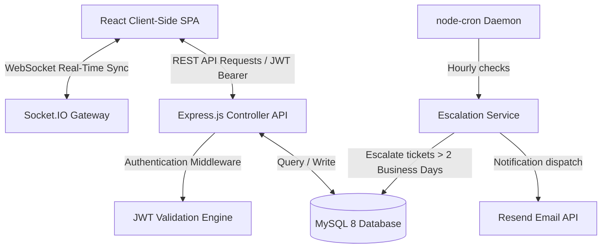

# LionDesk: Departmental Help-Desk System

LionDesk is a premium, automated web-based ticketing platform built specifically for the students, staff, and administration of the Department of Computer Science at the University of Nigeria, Nsukka (UNN). It resolves the chronic communication gaps in high-volume academic environments by allowing students to submit detailed registry, facility, or course complaints, automatically routing those complaints to the exact workstation of designated staff specialists, and escalating neglected requests to the Head of Department (HOD) for administrative review.

---

## 🛠️ Technologies Used
*   **Frontend**: React with TypeScript, Vite, Tailwind CSS v4, TanStack Query (server state synchronization & caching).
*   **Backend**: Node.js with Express.js, Socket.IO (instant WebSocket updates).
*   **Database**: MySQL 8.x (relational schema with key-constraint bindings and ACID transaction guarantees).
*   **Services**: Resend API (email notifications), Swagger UI (REST documentation at `/api-docs/`), node-cron (hourly automated business-day escalation checking).

---

## ⚡ Key Features & Challenges
LionDesk manages real-time ticketing workloads and automates complex routing transitions, solving the challenge of balancing staff allocations by auto-assigning incoming complaints to the specialist with the fewest active tickets in the matching category. Building this project was a lesson in implementing complex calendar computations—specifically calculating escalation thresholds based strictly on **2 business days** (excluding weekends)—and integrating Socket.IO events to trigger automatic TanStack Query cache invalidations so that dashboards update instantly without page reloads.

---

## 📐 Architecture Overview



### System Communication Flow
1.  **Client-Server Interface**: The React frontend talks to the Express backend using an Axios client pre-configured with interceptors that attach JWT tokens from `localStorage` to every request.
2.  **State Syncing**: TanStack Query handles local server-state caches, while a background Socket.IO connection pushes instant notifications when tickets are updated or assigned, triggering query updates.
3.  **Cron Services**: An hourly cron daemon evaluates database entries to identify unresolved tickets exceeding the 2 business days limit, recalculating statuses and sending email alerts via the Resend service.

---

## ⚙️ Technical Decisions

### 1. MySQL 8 (Relational) vs. MongoDB (NoSQL)
We selected MySQL because LionDesk relies on strict relational logic: tickets must map directly to registered students, staff members, and category tables. Using foreign key constraints (`ON DELETE RESTRICT`, `ON UPDATE CASCADE`) guarantees referential integrity, preventing orphans, while SQL transactions ensure that status updates, history comments, and staff workload recalculations execute atomically under strict ACID guarantees.

### 2. JWT Authentication vs. Server-Side Sessions
We chose stateless JWT authentication over traditional session cookies to keep the Node.js API server fully stateless. This allows the backend to scale horizontally without session synchronizers, and facilitates deployment to serverless platforms (like Render or Vercel) while maintaining secure token authorization inside standard HTTP headers.

### 3. Progressive Split-Step Activate Student Activation Flow
To block malicious registrants, we designed a two-step activation wizard. In the first step, the student inputs their Matriculation Number and Full Name; the backend queries the preloaded official registry table and throws highly detailed errors (e.g., distinguishing "mismatched name" from "matric number not in registry"). Only upon validation does Step 2 present the password creation form, preventing database clutter from invalid account records.

---

## 🚀 Setup Instructions

Follow these step-by-step commands to get the system running locally in under 5 minutes.

### 1. Configure the Backend (`/server-side`)
1.  Navigate into the directory:
    ```bash
    cd server-side
    ```
2.  Install dependencies:
    ```bash
    npm install
    ```
3.  Create your environment file:
    ```bash
    cp .env.example .env
    ```
4.  Configure `.env` using these example variables:
    ```ini
    PORT=5000
    JWT_SECRET=super_secret_liondesk_token_signature_key_2026
    RESEND_API_KEY=re_123456789abc_examplekey
    EMAIL_FROM=liondesk@unn.edu.ng
    DB_HOST=127.0.0.1
    DB_PORT=3306
    DB_USER=root
    DB_PASSWORD=your_mysql_password_here
    DB_NAME=liondesk
    ```
5.  Set up the database schema:
    Run the migrations or SQL files provided inside `/server-side/src/config/schema.sql` (if database initialization script isn't run automatically).
6.  Start the development server:
    ```bash
    npm run dev
    ```

### 2. Configure the Frontend (`/client-side`)
1.  Navigate to the directory:
    ```bash
    cd ../client-side
    ```
2.  Install dependencies:
    ```bash
    npm install
    ```
3.  Create your environment file:
    ```bash
    cp .env.example .env.local
    ```
4.  Configure `.env.local` using these variables:
    ```ini
    VITE_API_URL=http://localhost:5000
    ```
5.  Start the local dev server:
    ```bash
    npm run dev
    ```

---

## 📸 Interface Screenshots & Responsive Views

### Student Dashboard View (Desktop & Mobile)
*   **Desktop**: Features a rich three-column layout showing active complaint counters, dynamic status timeline steps, and real-time chat bubbles with specialists.
*   **Mobile**: Collapse sidebar transitions into a bottom nav bar; data tables convert to touch-friendly card elements.

### Administrative Control Hub (HOD View)
*   **Analytics Reports**: Displays SVG-based D3.js statistical charts tracking complaint volumes by category and status breakdown.
*   **Staff Specialist Roster**: Allows deactivating/activating specialists and manual workload reassignments.
